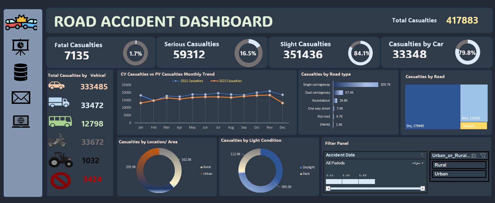

# 📊 Road Accident Excel Data Analysis Project

## 🧠 Overview
This Excel-based data analysis project explores road accident data in the UK to identify **key patterns, causes, and safety trends**.  
The dashboard helps visualize insights that can support decision-making for traffic management and accident prevention.

---

## 🛠 Tools & Techniques Used
- **Microsoft Excel**: Data cleaning, transformation, and visualization  
- **Power Query**: Merging and transforming multiple data tables  
- **Pivot Tables & Charts**: Generating insights and summary reports  
- **Data Visualization**: Interactive dashboard design for clear communication  

---

## 📈 Key Insights
- Peak accidents occur between **4 PM and 6 PM**, especially during weekdays.  
- **Urban areas** record a higher number of minor accidents compared to rural ones.  
- **Weather conditions** like rain and fog slightly increase accident rates.  
- **Car drivers** and **pedestrians** are the most frequently involved categories.  

---

## 🖼 Dashboard Preview

---

## 📂 Project Files
| File | Description |
|------|--------------|
| `Road Accident Data.xlsx` | Dataset used for analysis |
| `ROADAC~1.PNG` | Final Excel dashboard |
| `REQUIREMENT.jpg` | Problem statement and project requirements |
| `README.md` | Project summary and documentation |

---

## 🧾 How to View the Dashboard
1. Download the Excel file from the repository.  
2. Open it in Microsoft Excel (2019 or later).  
3. Navigate to the **Dashboard** sheet to explore interactive visuals.  

---

## 🧑‍💼 About the Analyst
**Mohamed Talaat** — Data-driven professional skilled in **Excel, Power BI, and Data Analysis**.  
Passionate about turning raw data into actionable insights.  

🔗 [LinkedIn Profile](https://www.linkedin.com/in/YourLinkedInProfileLink)
